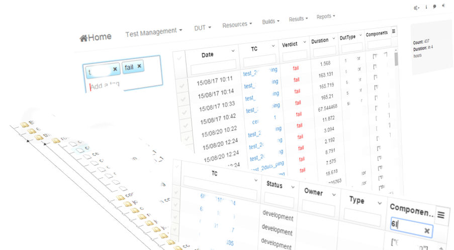

# OpenTMI - Open Source Test Management Infrastructure

[](https://greenkeeper.io/)

 [![Build Status][build-image]][build-url]
 [![Dependencies Status][depupdated-image]][depupdated-url]
 [![devDependencies Status][devdepupdated-image]][devdepupdated-url]


 <!--
[![Test Coverage][coveralls-image]][coveralls-url]
-->

OpenTMI is Open Source Test Management System. It is written in [Node.js][Node.js] / Javascript and uses [MongoDB][MongoDB] as backing store. It is published in [GPLv3 license](LICENSE.md).



OpenTMI is extremely customizable through [addons](doc/addons.md).

# Ideology

Basic idea is to store **all** information related to test execution, like software under test (SUT/Build), test logs, test cases (TC), and test related resources, like DUT's to database which allows then much more intelligent and more efficient way to manage testing. Also it gives very valuable information when users can directly see what is tested in individual Device with individual Build. All information is linked together and can be analyzed very deeply.

# Pre-requirements

* Node.js v6.1< (tested with 6.1, recommended to use latest LTS version)
* mongodb v3.2< (recommented to use latest version)

# Installation

## From Dockers

```
docker pull opentmi/opentmi:latest mongo:latest
docker run -v "$(pwd)":/data --name mongo -d mongo mongod --smallfiles
docker run --name opentmi -p 3000:3000 --link mongo:mongo -d opentmi/opentmi
```

See [here](doc/docker.md) for more instructions.

## Prepare

You need to install [mongodb][MongoDB] and run it. File `mongod.sh` contains simple script to start single mongod instance (db location ./db and logs ./db.logs) - that is not recommended for production usage.

## Clone, install dependencies and start

```
> git clone --recursive https://github.com/OpenTMI/opentmi
> cd opentmi
> npm install
> npm start

or start without clustered mode

> node app
```

**Note:** Installation install also all addons dependencies so you doesn't need to worry about it.

# Command line

```
$ npm start -- -h
Usage: npm start -- (options)

Options:
  --listen, -l   set binding interface             [string] [default: "0.0.0.0"]
  --https        use https                                      [default: false]
  --port         set listen port                      [required] [default: 3000]
  --env, -e      Select environment (development,test,production)
                                               [string] [default: "development"]
  --verbose, -v  verbose level                                           [count]
  --silent, -s   Silent mode                                    [default: false]
```

**https:**
Generate self-signed ssl certifications:
* `./scripts/gencerts.sh`
* start daemon with `--https` -options (`npm start -- -https`)

## Clustered mode

OpenTMI support [clustered mode](doc/cluster.md) which gives some benefits in production environment:
* better performance
* zero downtime when updating
* auto restart on failure
* serve more clients
* better performance

## API documentation
Available [here](doc/APIs)

## Configuration

By default it start server as development mode. You can configure environment using [env.json](`config/env/env.example.json`)
```
{
  "OPENTMI_BIND": "0.0.0.0",
  "OPENTMI_PORT": 80,
  "WEBTOKEN": "token",
  "MONGODB": "mongodb://localhost/opentmi",
  "FILE_DB": "./data",
  "OPENTMI_ADMIN_USERNAME": "admin",
  "OPENTMI_ADMIN_PASSWORD": "admin",
  "GITHUB_CLIENTID": "ID",
  "GITHUB_SECRET": "SECRET",
  "GITHUB_ORG": "ORGANIZATION",
  "GITHUB_CBURL": "GITHUB_CBURL",
  "GITHUB_ADMINTEAM": "ADMIN-TEAM"
}
```

# Architecture

* **Backend** (this repository)
 * which provide [RESTFull json and websockets (through socketIO) -API](doc/APIs), internal [load balancer](doc/cluster.md) and auto restart on failure etc...
   Backend functionality can be extended with addons. This allows to use business -related secret stuff for example..
* **Frontends**
 * OpenTMI provide [default web GUI](https://github.com/opentmi/opentmi-default-gui), which is single addon in backend actually.
    webGUI is written with angularJS.
* **Client libraries**
 * [opentmi-client-python](https://github.com/opentmi/opentmi-client-python) provide python API for test tools. E.g. for uploading test results to openTMI.
 * [opentmi-jsclient](https://github.com/opentmi/opentmi-jsclient) for nodejs / browser

### Addons
Way to extend backend-service functionality. Addon registry (future plan) contains information about existing addons, which can easily to install via administrator API. More documentation can be found from [here](doc/addons.md)

### Test

`npm test`

### Contribution guidelines

* Writing tests
* Code review
* Other guidelines

See [code-of-conduct](CODE_OF_CONDUCT.md)

### Production usage

Propose to use some service management tool which can restart service if it for some reason crashes.

You can use for example:
* [supervisor](https://github.com/petruisfan/node-supervisor)
  `supervisor -wa . -n exit server.js`
* [pm2](https://github.com/Unitech/pm2)
  `pm2 start --name opentmi index.js -- -vvv`
* linux [systemd](https://www.freedesktop.org/wiki/Software/systemd/)
  see [example](scripts/opentmi.service)

 **Note:** if your service management is storing `stdout` and `stderr` to log
 files - be sure that it is rotated properly to ensure that disk space doesn't
 cause trouble. By default OpenTMI store logs log/ -folder, configured as
 daily rotate.

### Who do I talk to?

* Repo owner or admin
* Other community or team contact

## License

  [GPL-3.0](LICENSE.md)

<!-- references -->
[Node.js]: https://nodejs.com
[MongoDB]: https://mongodb.com

[build-image]: https://circleci.com/gh/OpenTMI/opentmi.svg?style=svg
[build-url]: https://circleci.com/gh/OpenTMI/opentmi
[coveralls-image]: https://coveralls.io/repos/OpenTMI/opentmi/badge.svg?branch=master&service=github
[coveralls-url]: https://coveralls.io/github/OpenTMI/opentmi?branch=master

[depupdated-image]: https://david-dm.org/opentmi/opentmi.svg
[depupdated-url]: https://david-dm.org/opentmi/opentmi
[devdepupdated-image]: https://david-dm.org/opentmi/opentmi/dev-status.svg
[devdepupdated-url]: https://david-dm.org/opentmi/opentmi?type=dev
