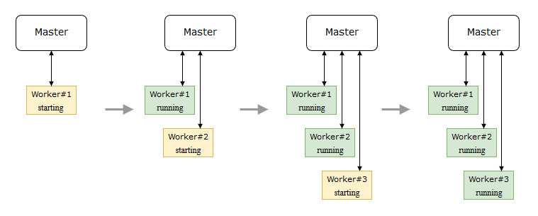
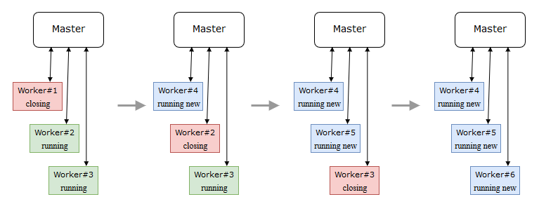

# Clustering
OpenTMI uses Node's [Cluster](https://nodejs.org/dist/latest-v6.x/docs/api/cluster.html) module to manage multiple node worker processes. Distributing requests to multiple workers allows OpenTMI to use all the cores available on the host machine.

To start OpenTMI in cluster mode you need to run the npm script cluster

`npm run cluster`

### Master startup procedure
Master process startup consists of two parts, subscribing to event sources and spawning workers.

subscribed events
<table>
  <tr>
    <th>Event name</th>
    <th>Reaction</th>
  </tr>
  <tr>
    <td>masterStatus</td>
    <td>Emits event containing current machine/worker status to all the workers.</td>
  </tr>
  <tr>
    <td>workerRestartNeeded</td>
    <td>Starts worker update procedure.</td>
  </tr>
  <tr>
    <td>systemRestartNeeded</td>
    <td>Marks that the server needs a restart.</td>
  </tr>
  <tr>
    <td>*</td>
    <td>Broadcasted messages are logged.</td>
  </tr>
</table>

### Worker spawning procedure
OpenTMI starts a worker process for each cpu core available on the host machine.

Workers are started one by one serially.

### Worker update procedure
It is possible to trigger an update that reloads all workers without any downtime.

There are two ways to trigger the update procedure, either manually via the API or automatically by starting the server with *--auto-reload* command line parameter. Auto reload restarts all the workers whenever a change is detected in the app directory of the server.

`npm run cluster --auto-reload`

Changes to source files that the master process is using do not trigger an automatic restart as those changes will not become visible unless the whole server is restarted. 

The update is a rolling restart that kills and then restarts workers one by one, roughly in a similar manner as seen in the startup procedure.

### Worker crashes
When a worker crashes OpenTMI automatically attempts to spawn a new worker to replace it.